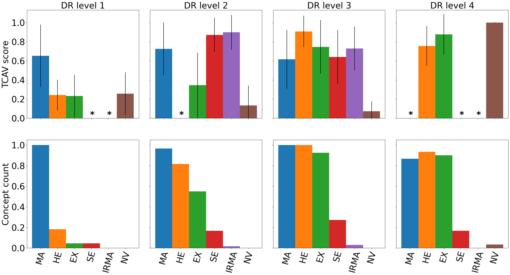

# Looking into Concept Explanation Methods for Diabetic Retinopathy Classification

This repo includes the source code for training the DR classification models and generate explanations using Testing with Concept Activation Vectors (TCAV) (Kim et al.) and Concept Bottleneck Models (Koh et al.). All datasets are publicly available. For access to the datasets, please refer to the respective dataset sources. 

